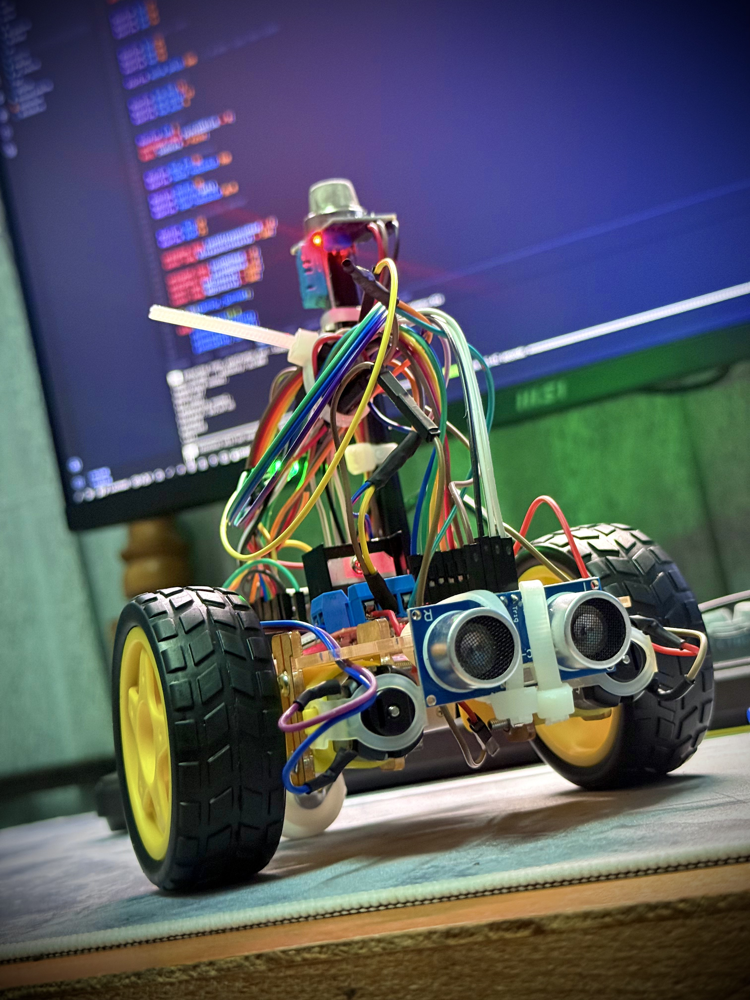

<h1 align="center">Fire-Patrol-Bot - by Evidence Tsongodza</h1>

<p align="center">
  
</p>

<p align="center">
  <b>Educational embedded systems project - autonomous fire detection robot</b>
</p>

<p align="center">
  <a href="#-about">About</a> &nbsp;·&nbsp;
  <a href="#-why-esp32">Why ESP32?</a> &nbsp;·&nbsp;
  <a href="#-key-features">Features</a> &nbsp;·&nbsp;
  <a href="#-why-dual-sensor-validation-matters">Sensor Fusion</a> &nbsp;·&nbsp;
  <a href="#-detection-states">States</a> &nbsp;·&nbsp;
  <a href="#-wiring">Wiring</a> &nbsp;·&nbsp;
  <a href="#-flashing">Flashing</a> &nbsp;·&nbsp;
  <a href="#-stability">Stability</a> &nbsp;·&nbsp;
  <a href="#-roadmap">Roadmap</a>
</p>

---

<h2>📌 About</h2>

**Fire-Patrol-Bot** is an autonomous room-patrol robot built on the **ESP32 NodeMCU-32S**, combining a 2WD chassis, dual-sensor fire detection (MQ-2 smoke + DHT11 temperature), ultrasonic obstacle avoidance, and a visual/audible alarm system. It patrols a room on its own, confirms danger using two independent sensors before alerting, and stops to sound the alarm the moment a real threat is detected.

This project was built from the ground up over 4 weeks - starting with pure software simulation while the hardware was unavailable, then moving through physical wiring, sensor calibration, and full autonomous integration.

> [!NOTE]
> Built strictly for educational purposes as an embedded systems learning project. Not a certified life-safety device - do not rely on it as a replacement for a real smoke detector.

---

<h2>🔬 Why ESP32?</h2>

The original idea could have run on an Arduino UNO, but the UNO has **no WiFi**. Once the goal expanded to include real-time phone alerts, that ruled it out immediately.

The **ESP32 NodeMCU-32S** solves this with a dual-core processor, built-in WiFi, far more usable GPIO pins than the UNO, and dedicated ADC pins for clean analog sensor reads. That meant the smoke sensor, temperature sensor, ultrasonic sensor, motor driver, RGB status LED, and buzzer could all run simultaneously alongside a WiFi connection - without ever needing a second microcontroller.

**The catch?** ESP32's `analogWrite()` doesn't behave like it does on Arduino - PWM motor speed control required switching to `ledcAttach()` / `ledcWrite()` instead. Upload stability was also a recurring fight: the L298N's 5V output line fighting with USB power during flashing caused repeated failed uploads until the two were kept strictly separate.

---

<h2>⚡ Key Features</h2>

| | Feature | Detail |
|---|---|---|
| 🧠 | **Platform** | ESP32 NodeMCU-32S |
| 🚗 | **Chassis** | 2WD robot platform, L298N motor driver |
| 🔥 | **Smoke detection** | MQ-2 gas sensor, calibrated threshold |
| 🌡️ | **Temperature detection** | DHT11 sensor |
| 🛡️ | **False-alarm protection** | Dual-sensor confirmation required before alert |
| 📡 | **Obstacle avoidance** | HC-SR04 ultrasonic, autonomous patrol routing |
| 🚨 | **Alarm system** | Active buzzer + RGB LED status indicator |
| 🔄 | **Non-blocking firmware** | millis()-based timing, zero delay() calls |
| 📶 | **Remote alerts** | Telegram Bot notification over WiFi |
| 💡 | **Status LED** | Color-coded patrol/avoid/danger states |

---

<h2>🛡️ Why Dual-Sensor Validation Matters</h2>

A single smoke sensor alone is unreliable - cooking smoke, dust, or steam can all trigger a false alarm. Relying on temperature alone is just as bad - a sunny windowsill or a warm room can cross a naive threshold with nothing actually wrong.

**Fire-Patrol-Bot requires BOTH conditions at once.** The buzzer and red alarm state only activate when the MQ-2 smoke reading AND the DHT11 temperature reading exceed their calibrated thresholds simultaneously. This sensor fusion approach is the same principle used in real industrial fire-detection systems, and it is what keeps the robot from crying wolf over a slice of toast.

> [!TIP]
> Thresholds were not taken from a datasheet - they were calibrated by hand on the physical sensor: clean air read around 500 (ADC), open flame nearby read up to 1300, so the trigger point was set at 900.

---

<h2>🎯 Detection States</h2>

| State | Motors | RGB | Buzzer | Trigger |
|---|---|---|---|---|
| 🟢 **PATROL** | Moving | Green | Off | Default operating state |
| 🔵 **AVOID** | Stop / Turn | Blue | Off | Obstacle closer than 20cm |
| 🔴 **DANGER** | Stopped | Red | On | Smoke AND temperature both over threshold |

The robot continuously cycles sensor reads on independent timers (DHT11 every 2s, MQ-2 every 500ms, ultrasonic every 100ms) so no single slow sensor blocks the others - all timing is handled with `millis()`, never `delay()`.

---

<h2>🔌 Wiring</h2>

| Component | Pin | ESP32 GPIO |
|---|---|---|
| L298N ENA | Speed (PWM) | GPIO14 |
| L298N IN1 / IN2 | Left motor direction | GPIO27 / GPIO26 |
| L298N IN3 / IN4 | Right motor direction | GPIO25 / GPIO33 |
| L298N ENB | Speed (PWM) | GPIO32 |
| DHT11 | Data | GPIO15 |
| MQ-2 | Analog out | GPIO34 |
| HC-SR04 | TRIG / ECHO | GPIO19 / GPIO21 |
| RGB LED | R / G / B | GPIO13 / GPIO12 / GPIO4 |
| Status LED | Anode | GPIO5 |
| Buzzer | Positive | GPIO18 |

**Power:** 9V battery → L298N +12V (motors) → L298N +5V out → ESP32 5V pin. Never connect 9V directly to the ESP32.

> [!WARNING]
> Always disconnect the L298N 5V line from the ESP32 before flashing over USB. Running both power sources at once causes upload failures (`Packet content transfer stopped`).

---

<h2>🚀 Flashing</h2>

Built and flashed with **VS Code + PlatformIO**.

```ini
[env:nodemcu-32s]
platform = espressif32
board = nodemcu-32s
framework = arduino
upload_speed = 115200
upload_port = /dev/ttyUSB0
lib_deps =
    adafruit/DHT sensor library
    adafruit/Adafruit Unified Sensor
```

<details>
<summary><b>Upload notes</b></summary>
<br>

- Disconnect the L298N 5V wire before connecting USB
- If upload fails with "Unable to verify flash chip connection", hold **BOOT** while it says `Connecting...`
- On Linux, if the port isn't found: `sudo chmod 666 /dev/ttyUSB0`
- After a successful upload: disconnect USB, reconnect the 5V wire, then power from the 9V battery

</details>

---

<h2>🔧 Stability</h2>

This project went through real hardware debugging, not just clean simulation. A few hard-won lessons baked into the current build:

- ESP32 PWM requires `ledcAttach()` / `ledcWrite()` - `analogWrite()` does not work reliably for motor speed
- The L298N's ENA/ENB jumper caps must be physically removed before PWM speed control will work at all
- Motor direction polarity doesn't need to be solved in advance - wire either way and swap the two wires if a wheel spins backward
- USB and external 9V power must never be connected to the ESP32 at the same time

These were solved through direct trial and error on the physical board, not assumptions from a datasheet.

<details>
<summary><b>Roadmap</b></summary>
<br>

- [ ] WiFi + Telegram bot integration for remote alerts
- [ ] Timer-based zone patrol routine
- [ ] Data logging: temperature/smoke vs. position (room heat-map)
- [ ] Simple web dashboard for live sensor readings
- [ ] Return-to-start behavior on low battery

</details>

---

<h1 align="center">DISCLAIMER</h1>
<h4 align="center">This project is an educational embedded systems build, not a certified safety device. Do not rely on it as a substitute for a commercial smoke detector or fire alarm system.</h4>
